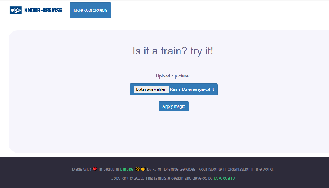
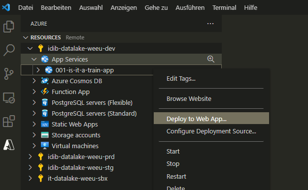

# Train Classifier - Our first AI Application

This is the Flask application for the our "is it a train classifier". The website takes a static image as input, runs an ml classifier over the image and returns the result. 

The whole web page is hosted on Azure.

## Technical high-lights

The application uses a [MobileNetV2](https://keras.io/api/applications/mobilenet/) neural network for inference.

MobileNetV2 is very similar to the original MobileNet, except that it uses inverted residual blocks with
bottlenecking features. It has a drastically lower parameter count than the original MobileNet.

MobileNets support any input size greater than 32 x 32, with larger image sizes offering better performance.

Reference: [MobileNetV2: Inverted Residuals and Linear Bottlenecks](https://arxiv.org/abs/1801.04381) in CVPR 2018.

## Demo

You can try the application yourself at [traindemo.projects.knorr-bremse-digital.com](https://traindemo.projects.knorr-bremse-digital.com/).

## Set-Up

After updating the Azure function, please deploy to **kbazfunction**. This is easiest done with the [Azure function app plugin](https://marketplace.visualstudio.com/items?itemName=ms-azuretools.vscode-azurefunctions) for Visual Studio Code.

## Further docs
Quickstart [Deploy a Python (Django or Flask) web app to Azure App Service](https://docs.microsoft.com/en-us/azure/app-service/quickstart-python).  For instructions on how to create the Azure resources and deploy the application to Azure, refer to the Quickstart article.
